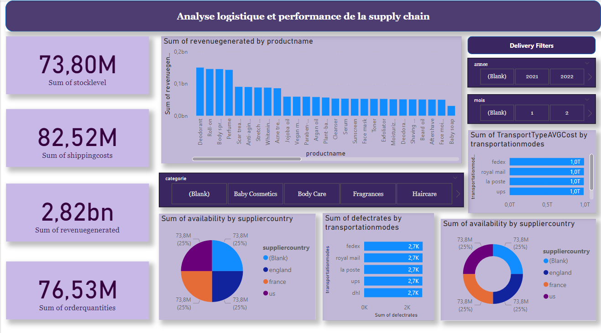
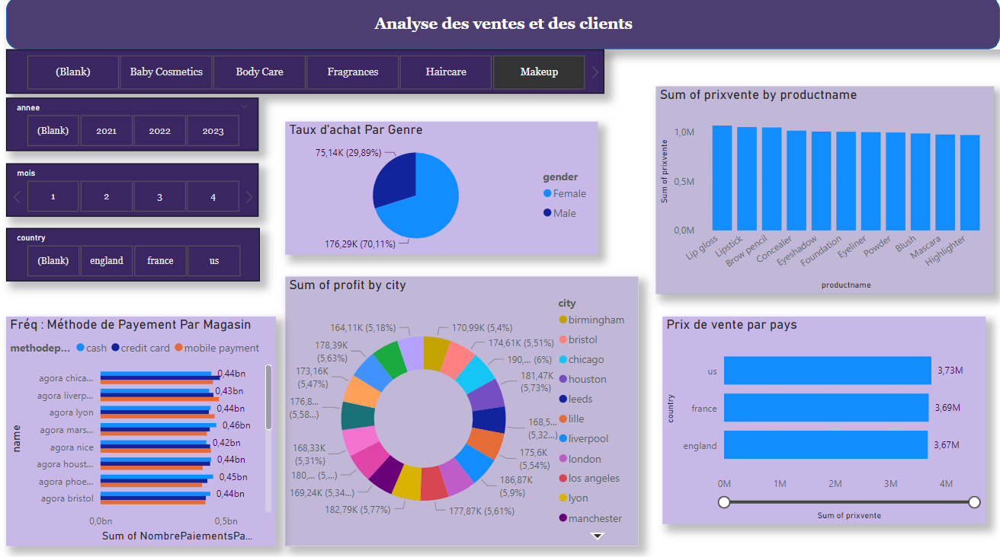

# BI_Retail Project

## Table of Contents

- [BI\_Retail Project](#bi_retail-project)
  - [Table of Contents](#table-of-contents)
  - [Overview](#overview)
  - [Prerequisites](#prerequisites)
  - [Installation](#installation)
  - [Data Generation](#data-generation)
  - [Setting Up the Environment](#setting-up-the-environment)
  - [Setting Up the Data Warehouse](#setting-up-the-data-warehouse)
  - [Running ETL Processes](#running-etl-processes)
  - [Connecting to PowerBI](#connecting-to-powerbi)
  - [Dashboards](#dashboards)
    - [Dashboard 1: Analyse Logistique et Performance de la Supply Chain](#dashboard-1-analyse-logistique-et-performance-de-la-supply-chain)
    - [Dashboard 2: Analyse des Ventes et des Clients](#dashboard-2-analyse-des-ventes-et-des-clients)
  - [Troubleshooting](#troubleshooting)
  - [Project Structure](#project-structure)
  - [License](#license)

## Overview

The **BI_Retail** project is a comprehensive Business Intelligence solution designed to analyze and visualize retail supply chain and sales data. It leverages Docker for environment setup, Apache Airflow for workflow management, PostgreSQL as the data warehouse, and PowerBI for data visualization.





## Prerequisites

Before setting up the project, ensure you have the following installed on your Linux system:

- **Docker**: For containerization.
- **Docker Compose**: To manage multi-container Docker applications.
- **Python 3.8+**: For running Python scripts.
- **Git**: To clone the repository.
- **PowerBI Desktop**: For creating dashboards (available on Windows).

## Installation

1. **Clone the Repository**

   ```bash
   git clone https://github.com/Amiche02/BI_Retail.git
   cd BI_Retail
   ```

2. **Configure Environment Variables**

   - Navigate to the `docker` directory and copy the example `.env` file:

     ```bash
     cp docker/.env.example docker/.env
     ```

   - **Generate Airflow Fernet Key**

     Run the following Python script to generate a Fernet key for Airflow:

     ```bash
     python3 docker/airflowkey.py
     ```

     - Copy the generated key.
     - Open the `.env` file and paste the key into the `AIRFLOW_FERNET_KEY` variable:

       ```env
       AIRFLOW_FERNET_KEY=your_generated_fernet_key
       ```

   - **Adjust Other Environment Variables**

     Ensure that the `DB_PORT` in `.env` does not conflict with existing services on your machine.

## Data Generation

Before deploying the environment, generate the necessary datasets.

1. **Navigate to the Data Sources Directory**

   ```bash
   cd data_sources
   ```

2. **Generate Supply Chain Data**

   ```bash
   python3 supply_chain.py
   ```

   - **Output**: `supply_chain.csv` and `supply_chain_updated.csv`
   - **Location**: `data_sources/`

3. **Generate Transactions Data**

   ```bash
   python3 transaction.py
   ```

   - **Output**: `transactions.csv` and `supply_chain_updated.csv`
   - **Location**: `data_sources/`

   *Alternatively, for faster transaction generation:*

   ```bash
   python3 fast_transactions.py
   ```

   - **Note**: Choose either `transaction.py` or `fast_transactions.py` based on your performance needs.

4. **Place Generated Data**

   Ensure that the generated CSV files are placed in the correct directories as expected by the ETL scripts. By default, the paths are:

   - `data_sources/data/supply_chain_updated.csv`
   - `data_sources/data/transactions.csv`

   *If you choose different paths, update the paths in `scripts/etl_to_dwh.py` accordingly.*

## Setting Up the Environment

1. **Start Docker Containers**

   From the root of the project directory, run:

   ```bash
   sh up.sh
   ```

   - **What It Does**:
     - Builds and starts Docker containers for PostgreSQL and Airflow.
     - Sets up necessary directories and volumes.

2. **Accessing Airflow Worker (If DAGs Are Not Working)**

   If your DAGs are not functioning as expected, access the Airflow worker container:

   ```bash
   docker exec -it docker-airflow-worker-1 bash
   ```

   - **Within the Container**:
     - Connect to the PostgreSQL database using `psql` or another PostgreSQL client.
     - Alternatively, use **pgAdmin4** for a graphical interface.

## Setting Up the Data Warehouse

1. **Connect to the PostgreSQL Database**

   - **Using pgAdmin4**:
     - Open pgAdmin4.
     - Create a new server connection with the following details from `.env`:

       ```env
       Host: localhost
       Port: 5433
       Username: airflow
       Password: postgres
       ```

2. **Create the Data Warehouse Schema**

   From the host machine, run:

   ```bash
   python3 scripts/datawarehouse.py
   ```

   - **What It Does**:
     - Connects to PostgreSQL.
     - Creates the `AGORA_DATA_WHEREHOUSE` database if it doesn't exist.
     - Drops existing tables and recreates the necessary schema.

## Running ETL Processes

After setting up the data warehouse, perform the ETL (Extract, Transform, Load) process to populate the data warehouse with transformed data.

1. **Run the ETL Script**

   ```bash
   python3 scripts/etl_to_dwh.py
   ```

   - **What It Does**:
     - Reads data from `supply_chain_updated.csv` and `transactions.csv`.
     - Cleans and transforms the data using Spark.
     - Loads the transformed data into the PostgreSQL data warehouse.

## Connecting to PowerBI

Once the data is loaded into PostgreSQL, you can connect PowerBI to the data warehouse for analysis and dashboard creation.

1. **Open PowerBI Desktop**

2. **Get Data**

   - Select **PostgreSQL** from the data sources.
   - Enter the connection details:

     ```env
     Server: localhost,5433
     Database: AGORA_DATA_WHEREHOUSE
     Username: airflow
     Password: postgres
     ```

3. **Import Tables**

   - Choose the necessary dimension and fact tables for your analysis.

4. **Create Dashboards**

   - Utilize the imported data to build interactive dashboards as described below.

## Dashboards

### Dashboard 1: Analyse Logistique et Performance de la Supply Chain


**Description:**

This dashboard highlights the logistical and operational performance of the supply chain. Key components include:

- **Key Performance Indicators (KPIs):**
  - **Sum of StockLevel**: Total quantity of products in stock.
  - **Sum of ShippingCosts**: Total cost of shipments.
  - **Sum of RevenueGenerated**: Revenue generated from sales.
  - **Sum of OrderQuantities**: Total quantity of products ordered.

- **Visualizations:**
  - **Bar Chart - Revenue par produit (ProductName)**: Displays revenue generated for each product.
  - **Pie Chart - Disponibilité par pays fournisseur (SupplierCountry)**: Shows distribution of availability by supplier country.
  - **Bar Chart - Taux de défauts par mode de transport (TransportationModes)**: Indicates defect rates by transportation mode.
  - **Bar Chart - Coût moyen par mode de transport (TransportTypeAVGCost)**: Shows average shipping cost by transportation mode.

- **Dynamic Filters:**
  - **Year and Month**: Filter data based on specific periods.
  - **Product Categories**: Filter by specific product types.

### Dashboard 2: Analyse des Ventes et des Clients


**Description:**

This dashboard focuses on sales analysis and customer behavior to identify trends and store performance. Key components include:

- **Key Performance Indicators (KPIs):**
  - **Total Sales and Profits Generated**.
  - **Frequency of Payment Methods Used**.

- **Visualizations:**
  - **Pie Chart - Taux d'achat par genre (Gender)**: Shows the distribution of purchases between males and females.
  - **Bar Chart - Ventes par produit (PrixVente)**: Displays the best-selling products.
  - **Donut Chart - Profit par ville (City)**: Compares profits across different cities.
  - **Bar Chart - Prix de vente par pays (Country)**: Highlights revenue by country.
  - **Bar Chart - Fréquence des méthodes de paiement par magasin**: Analyzes payment methods used in each store.

- **Dynamic Filters:**
  - **Year and Month**: View sales over specific periods.
  - **Country**: Filter data by specific countries.
  - **Product Categories**: View performance by product category.

## Troubleshooting

- **Airflow DAGs Not Running**

  - Access the Airflow worker container:

    ```bash
    docker exec -it docker-airflow-worker-1 bash
    ```

  - Check Airflow logs for errors:

    ```bash
    tail -f /opt/airflow/logs/scheduler/latest/*.log
    ```

- **Database Connection Issues**

  - Ensure PostgreSQL is running:

    ```bash
    docker ps
    ```

  - Verify connection details in `.env` file.

- **ETL Script Errors**

  - Check logs generated by the ETL scripts.
  - Ensure data files are correctly placed and paths are updated in `etl_to_dwh.py`.

## Project Structure

```
BI_Retail/
├── docker/
│   ├── Volumes/
│   ├── airflowkey.py
│   ├── .env.example
│   └── ...
├── scripts/
│   ├── etl_to_dwh.py
│   ├── datawarehouse.py
│   └── ...
├── data_sources/
│   ├── data/
│   │   ├── supply_chain.csv
│   │   ├── supply_chain_updated.csv
│   │   └── transactions.csv
│   ├── supply_chain.py
│   ├── transaction.py
│   └── fast_transactions.py
├── docs/
│   ├── Supply_chain.png
│   ├── Ventes.png
│   └── logo.png
├── up.sh
├── down.sh
└── README.md
```

## License

This project is licensed under the [MIT License](LICENSE).

---

*For any questions or support, please contact [projectsengineer6@gmail.com](mailto:projectsengineer6@gmail.com).*

